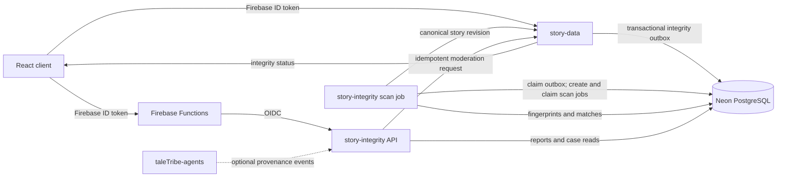
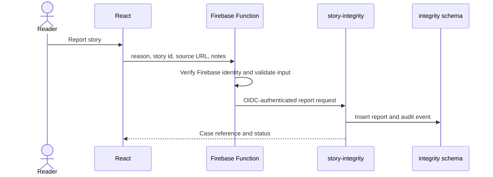
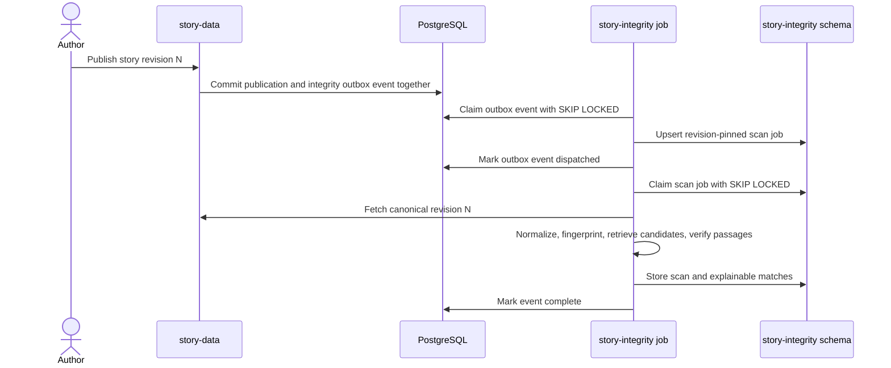

# ADR-0001: Story Integrity and Content Reporting Service

- **Status:** Proposed
- **Date:** 2026-09-18
- **Decision owners:** TheTaleTribe platform
- **Scope:** Public stories, competition submissions, and user reports
- **Proposed service:** `story-integrity`

## Context

TheTaleTribe is a story-writing and reading application with an editor, public
reader, social features, competitions, and AI-assisted writing. The initial user
base is expected to be the project's owner and a small group of friends. The
competition currency is fictional and has no cash value.

This makes a full commercial trust-and-safety organization, formal legal case
management system, or expensive third-party plagiarism service inappropriate at
the current stage. It does not eliminate the product problem: a member can copy
another work, republish a TheTaleTribe story, submit copied text to a competition,
or misuse the reporting system.

The primary goal of this proposal is therefore technical learning and portfolio
value. It should demonstrate:

- clear microservice and data-ownership boundaries;
- asynchronous, idempotent processing;
- document fingerprinting and approximate similarity search;
- explainable detection results rather than opaque model scores;
- moderation workflows with authorization and auditability;
- graceful degradation and cost-aware deployment.

The service is not intended to decide whether copyright infringement has legally
occurred. It identifies textual similarity and supplies evidence for a human
decision.

## Industry context

TheTaleTribe overlaps two existing product categories but combines them differently.

| Product | Relevant behavior | Lesson for TheTaleTribe |
| --- | --- | --- |
| Wattpad | Community publishing platforms expose story and user reporting flows, including copyright-related reports, and pair removal with review or appeal processes. | Reporting is a first-class product workflow, not merely an email address or an automated classifier. |
| Sudowrite | AI-assisted fiction software emphasizes that writers retain their content and recommends checking generated prose for originality. Its editor visually distinguishes newly generated text until the writer edits it. | AI provenance and writer review are more useful than pretending an AI-text detector can determine authorship. |
| Amazon KDP | Publishing guidance separates AI-generated content from AI-assisted content and leaves responsibility for rights compliance with the publisher. | TheTaleTribe can use clear disclosure categories without prohibiting ordinary AI assistance. |

References:

- [Wattpad copyright-infringement reporting](https://support.wattpad.com/hc/en-us/articles/204471770-Reporting-Copyright-Infringement)
- [Wattpad content guidelines](https://support.wattpad.com/hc/en-us/articles/200774334-Content-Guidelines)
- [Sudowrite intellectual property and originality guidance](https://docs.sudowrite.com/legal-stuff/h8ppDEnJAwytH3jhJKu6c1/intellectual-property-and-ownership/bR8b2buPpQqqiYAaZNDU4H)
- [Sudowrite Write provenance UI](https://docs.sudowrite.com/using-sudowrite/1ow1qkGqof9rtcyGnrWUBS/write/pvxUvbQqYybfEosqx1sXjY)
- [Amazon KDP content and AI-content guidelines](https://kdp.amazon.com/en_US/help/topic/G200672390)

These products are reference points, not specifications to copy. TheTaleTribe's
distinctive technical project is an explainable similarity pipeline integrated
with an authoring system, public catalog, and competition state machine.

## Decision

Create a new `story-integrity` microservice responsible for:

1. receiving and tracking user reports;
2. scheduling and executing story similarity scans;
3. storing document fingerprints and verified matches;
4. grouping reports and scan findings into review cases;
5. recording moderation decisions and append-only audit events;
6. exposing integrity status to story and competition workflows;
7. requesting a moderation action from `story-data` without directly changing
   story-owned rows.

`story-data` remains the system of record for stories, chapters, publication
state, and competitions. `story-integrity` owns integrity cases and derived
similarity data. A moderation decision does not give `story-integrity` direct
write access to the `stories` or `competitions` tables.

## Goals

- Let a signed-in user report a published story or competition submission.
- Let an author request an originality scan before publishing.
- Automatically scan a stable story revision after publication or competition
  submission.
- Detect exact copies and long copied passages within TheTaleTribe's corpus.
- Return the passages and source stories that contributed to a score.
- Require human review before content is hidden or an account is penalized.
- Preserve an audit trail of every report, finding, and moderation action.
- Prevent unresolved high-confidence competition cases from settling.
- Run at negligible idle cost for a small user base.

## Non-goals for the first version

- A formal DMCA notice and counter-notice system.
- Legal determinations of copyright ownership, fair use, or infringement.
- Automatic account bans or story removal based only on a detector score.
- Reliable detection of whether prose was written by AI.
- Continuous scanning of the public internet.
- Purchasing a commercial plagiarism corpus at launch.
- Detecting shared ideas, genres, tropes, character archetypes, or writing style.
- General-purpose moderation of every possible harmful-content category.
- A globally distributed streaming architecture.

Formal copyright workflows can be added if TheTaleTribe becomes a public commercial
platform. The data model should retain enough evidence and audit history to make
that evolution possible without pretending the MVP already provides it.

## Service boundary



### Why a separate service

Similarity analysis has a different workload from product CRUD:

- tokenization and fingerprinting are CPU-bound batch operations;
- scan latency does not belong on the author-facing save path;
- scanning may later use different libraries or language-specific workers;
- failures should delay an integrity result, not prevent story editing;
- the service can scale independently and stay at zero instances while idle;
- the boundary makes moderation authorization and audit access explicit.

The cost of an additional service is more deployment and operational complexity.
That cost is accepted because this service is intentionally a system-design and
text-analysis learning project. If it were only a report form, it should remain
inside `story-data` instead.

## Request and processing flows

### User report



The initial report categories are:

- suspected copying or unauthorized repost;
- impersonation or false attribution;
- competition rule violation;
- harassment, threats, or personal information;
- spam or other policy violation.

A report is an allegation, not proof. Duplicate reports from the same reporter
for the same target and reason should return the existing open case rather than
create unbounded rows.

### Publication scan



The outbox dispatch and scan may run in the same process, but they remain two
durable state transitions. If the process crashes after inserting the scan job
but before acknowledging the outbox event, the unique story-revision key makes
redelivery a no-op. The scan itself is eventually consistent: publishing
succeeds even when the detector is unavailable. A periodic reconciliation job
compares published story revisions with completed scans so that a missed or
poisoned work item cannot leave a story unscanned forever.

### Moderation action

`story-integrity` records a proposed or approved decision, then calls a private
`story-data` moderation endpoint with:

- the story or competition identifier;
- the reviewed revision;
- the requested action;
- a stable decision id used as the idempotency key;
- the authenticated moderator identity;
- a bounded reason code.

`story-data` rechecks authorization and owns the final state transition. This
prevents an integrity-service database compromise from becoming direct write
access to every story.

The initial actions are:

- `no_action`;
- `warn_author`;
- `request_changes`;
- `hide_from_public`;
- `restore_public_access`;
- `disqualify_submission`;
- `suspend_account` as a future administrative action.

Hiding should remove a work from public APIs, recommendations, search, and
competition galleries without immediately deleting the author's source data.

## Detection pipeline

The detector will prioritize lexical evidence. Semantic similarity is useful for
candidate discovery but is not evidence that text was copied.

### Stage 1: canonicalization

For each stable story revision:

1. extract chapter text in reading order;
2. decode editor markup into visible text;
3. normalize Unicode to NFKC;
4. normalize whitespace and quotation punctuation;
5. tokenize while retaining token-to-source offsets;
6. preserve paragraph and chapter boundaries;
7. compute a SHA-256 digest of both raw and normalized text.

The raw digest identifies an identical revision. The normalized digest catches
copies that differ only in formatting. Original source offsets are required to
show reviewers the matching passages.

### Stage 2: exact duplicate detection

Compare normalized document and chapter hashes. This is cheap, deterministic,
and should run before approximate methods.

Expected result:

```json
{
  "kind": "exact_chapter",
  "sourceStoryId": "...",
  "sourceChapterId": "...",
  "matchedTokens": 1842,
  "confidence": 1.0
}
```

### Stage 3: shingling and MinHash

- Build overlapping word shingles, initially seven tokens wide.
- Remove extremely common shingles using a corpus document-frequency ceiling.
- Generate a 128-value MinHash signature for each chunk.
- Use Locality-Sensitive Hashing bands to retrieve candidate chunks.
- Calculate true Jaccard similarity only for those candidates.

MinHash avoids comparing every chapter with every other chapter. The LSH
threshold is a recall control, not a moderation threshold.

Initial chunking should use approximately 500 tokens with 100-token overlap.
Configuration belongs in a versioned detector profile so a scan result can be
reproduced after tuning.

### Stage 4: passage verification

Candidate pairs are verified against the original token sequences using a
rolling-hash or sequence-alignment algorithm. Store:

- longest contiguous match;
- total matched tokens;
- percentage of each work matched;
- number of distinct matching passages;
- chapter and paragraph locations;
- short evidence excerpts;
- detector version and configuration.

The system must distinguish “20% of a 100-word prologue” from “20% of an
80,000-word novel.” Both the absolute matched length and proportional overlap
matter.

### Stage 5: optional semantic candidate retrieval

A later version may use pgvector to find paraphrased candidates. Semantic
results must be labelled `semantic_similarity`, never `copied_text`, until
lexical or human evidence confirms the relationship.

The service should own its embedding model metadata rather than silently depend
on the agents service's current 768-dimension contract. Reusing the same provider
is acceptable; sharing unversioned vectors is not.

### Score interpretation

The first release will produce facts and a review priority, not a plagiarism
percentage:

```text
priority = f(
  exact-document match,
  longest contiguous passage,
  total matched tokens,
  overlap percentage of both works,
  number of independent passages,
  relative publication time
)
```

Thresholds must be calibrated using a labelled fixture set containing:

- identical reposts;
- punctuation and formatting changes;
- reordered paragraphs;
- light paraphrases;
- legitimate quotations;
- public-domain passages;
- common genre phrases;
- two independently written stories with the same premise;
- an author's reuse of their own work;
- non-English and mixed-language stories.

No high-priority result causes an automatic takedown in version one.

## AI provenance

TheTaleTribe will not attempt to infer AI authorship from prose. Synthetic-text
detection is too easy to evade and too likely to generate false positives,
particularly for short passages and non-native English writers. NIST describes
these limitations in its
[Synthetic Content Transparency report](https://nvlpubs.nist.gov/nistpubs/ai/NIST.AI.100-4.pdf).

Instead, TheTaleTribe should record provenance it actually knows:

- text inserted by a TheTaleTribe AI action;
- text imported by the user;
- text typed or edited by the user;
- substantial edits after AI insertion;
- the model/provider and generation event id, without storing a provider key.

The user-facing disclosure can remain simple:

- `none_declared`;
- `ai_assisted` for brainstorming, editing, or small suggestions;
- `ai_generated` for substantial generated passages;
- `mixed`;
- `not_disclosed`.

Provenance is informational and useful for competition rules. It is not proof of
copyrightability, originality, or misconduct.

## Data ownership and storage

To keep costs low, the service will use an isolated `integrity` schema in the
existing Neon PostgreSQL database. It will connect as a restricted
`integrity_service` role.

`story-data` owns migrations for the shared database, following the existing
recommendations-schema pattern. `story-integrity` owns the semantic contract and
documents required grants.

Proposed tables:

| Table | Purpose |
| --- | --- |
| `integrity.reports` | User allegations and reporter-visible status |
| `integrity.cases` | Groups related reports and detector findings for review |
| `integrity.case_targets` | Story, revision, chapter, submission, or account under review |
| `integrity.scan_jobs` | Durable, idempotent scan requests and retry state |
| `integrity.scans` | One result per story revision and detector version |
| `integrity.chunk_fingerprints` | Hashes, MinHash signatures, and source offsets |
| `integrity.matches` | Verified pairwise passage evidence |
| `integrity.decisions` | Moderator decisions and stable idempotency keys |
| `integrity.audit_events` | Append-only case history |

Important constraints:

- one active scan per story revision and detector version;
- report idempotency key unique per caller request;
- a decision id may be applied only once;
- audit events cannot be updated in normal application paths;
- source and target in a match use canonical ordering to prevent duplicate pairs;
- deleting a public story retires fingerprints but does not destroy evidence for
  an open case;
- closed-case evidence receives an explicit retention deadline.

Outside its own schema, the service may access only:

- the story-data integrity outbox rows it is permitted to claim and acknowledge;
- published story identifiers and revision metadata;
- canonical content specifically requested for a scan;
- competition submission references needed for integrity checks.

It must not receive general access to private reading history, credit balances,
BYOK settings, or unrelated story drafts.

## Proposed API

The browser-facing endpoints are mediated by Firebase Functions, which verify
the Firebase user and mint an OIDC token for the private Cloud Run service.

```text
POST /v1/reports
GET  /v1/reports/{reportId}
POST /v1/stories/{storyId}/scans
GET  /v1/stories/{storyId}/integrity

GET  /v1/admin/cases
GET  /v1/admin/cases/{caseId}
POST /v1/admin/cases/{caseId}/decisions
POST /v1/admin/cases/{caseId}/close

POST /v1/internal/provenance-events
GET  /health
```

Authorization rules:

- any authenticated user may report a published target;
- a reporter may see only status and their own submitted information;
- a story owner may request and read their own scan summary;
- matched source excerpts from another private or hidden story are never exposed
  to the author;
- only administrators may inspect complete cases and make decisions;
- internal event ingestion requires audience-bound service identity;
- neither a request body nor a query parameter may assert the acting user id.

## Competition integration

Competition submissions create an immutable integrity target containing the
story id and submitted revision. Editing the story later does not rewrite the
evidence used to judge that entry.

Proposed gates:

1. submission creates a high-priority scan job;
2. voting may open while a scan is pending for the MVP, but the UI shows the
   operational state to administrators;
3. a confirmed integrity case can disqualify the submission;
4. settlement refuses to begin while a finalist has an unresolved blocking
   case;
5. the existing transaction and idempotent ledger logic remains responsible
   for any refund or payout behavior.

Because the currency has no cash value, the first version can keep review manual.
The settlement gate is still worth implementing because it demonstrates how an
eventually consistent service interacts safely with a transactional state machine.

## Security and abuse controls

| Threat | Control |
| --- | --- |
| Report spam | Authentication, per-user quota, duplicate suppression, bounded text and attachments |
| Reporter probes private stories | Reports accept only publicly resolvable targets; authorization is rechecked server-side |
| False or retaliatory report | No automatic penalty, reviewer evidence, reporter history, appeal path |
| Malicious moderator | Admin allowlist, append-only audit events, reason required for every action |
| Detector false positive | Explainable passages, calibrated fixtures, manual decision |
| Story changes during scan | Every job and result is pinned to a revision |
| Duplicate delivery | Idempotency keys and unique database constraints |
| Worker crash | Leased jobs, retry count, next-attempt time, stale-lease recovery |
| Integrity service compromise | Restricted database role and no direct writes to story-owned tables |
| Evidence leaks | Short bounded excerpts, admin-only case access, explicit retention |
| Expensive corpus scan | Per-user scan quotas, incremental jobs, maximum story size already enforced by story-data |

Reports and detector output must be treated as untrusted input. The first version
does not need an LLM in its decision path, eliminating prompt injection as a
moderation risk.

## Deployment and cost model

Use one repository and one container image with multiple commands:

```text
story-integrity serve       # FastAPI or Go HTTP service
story-integrity worker      # claims durable scan jobs
story-integrity reconcile   # finds published revisions without a completed scan
```

Production shape:

- one private Cloud Run service with `min_instances = 0`;
- one Cloud Run Job invoked on demand or on a low-frequency schedule;
- existing Neon PostgreSQL with an isolated schema and restricted role;
- no Redis, Kafka, Elasticsearch, dedicated vector database, or paid plagiarism
  provider in the MVP;
- CPU-heavy scans happen in the job, not in the request-serving container;
- immutable image tags and Terraform-managed deployment;
- external provider integration remains behind an interface and disabled by
  default.

This accepts cold starts and delayed results in exchange for negligible idle
infrastructure. At the expected friend-scale workload, a scan completing in
minutes is acceptable.

## Observability

Every request and job should carry a correlation id. Structured logs should
include identifiers but not full story or report text.

Operational measurements:

- open reports by age and priority;
- scan queue depth and age of oldest job;
- scan duration by document size;
- candidate pairs per scan;
- verified matches per scan;
- worker retries and permanently failed jobs;
- moderator outcomes and overturned decisions;
- detector false-positive rate from reviewed cases;
- published revisions missing a current scan;
- competition settlements blocked by integrity cases.

The health endpoint should verify database connectivity and schema version. It
should not fail merely because optional semantic or external scanning is disabled.

## Testing strategy

### Algorithm tests

- hand-computed shingle and Jaccard examples;
- deterministic MinHash signatures with fixed seeds;
- Unicode, punctuation, whitespace, and markup normalization;
- token-to-source offset reconstruction;
- exact copies, reordered paragraphs, and partial copies;
- public-domain/common-phrase false-positive fixtures;
- property tests for symmetry and stable canonical match ordering.

### Service tests

- Firebase/OIDC authentication and admin authorization;
- a user cannot report or inspect a private target;
- duplicate report and scan requests are idempotent;
- a crashed worker's lease is recoverable;
- story revision changes do not mutate an existing scan;
- moderation actions are applied once even after retries;
- hidden content disappears from public surfaces but remains available to its
  owner and authorized reviewers;
- a blocking competition case prevents settlement.

### Evaluation

Create a small labelled corpus rather than claiming an unsupported accuracy
number. Report precision and recall separately for:

- exact duplicates;
- long copied passages;
- lightly edited passages;
- reordered passages;
- legitimate similarity.

Tune thresholds only from this corpus. Record the detector profile with every
result so later algorithm changes do not make old decisions irreproducible.

## Alternatives considered

### Keep everything in `story-data`

This is the simplest operational choice and would be preferred if the only
requirement were a report form. It was rejected because CPU-heavy analysis,
experimental Python/text-processing dependencies, and asynchronous scan jobs
provide a meaningful independent service boundary.

### Use embeddings alone

Rejected as the primary detector. Embeddings are good at topical similarity,
which makes them likely to flag two independently written stories with similar
premises. They do not provide the passage-level evidence a reviewer needs.

### Send every story to a commercial plagiarism API

Deferred because it adds per-document cost, vendor dependency, manuscript
privacy concerns, and an external corpus whose scoring behavior cannot be fully
explained. It can later complement internal detection for public stories.

### Use an AI-text detector

Rejected for enforcement. It answers a different question, is vulnerable to
paraphrasing, and creates unacceptable false-positive risk. Known provenance is
recorded instead.

### Automatically hide high-scoring stories

Rejected for version one. A quotation, licensed translation, public-domain text,
or author repost can be highly similar without being a policy violation.

### Add Kafka or Pub/Sub immediately

Rejected at the expected scale. A PostgreSQL-backed durable job table and
transactional outbox provide retries and observability with fewer services and
lower fixed cost. A broker becomes appropriate when database polling or worker
contention is measured as a bottleneck.

## Consequences

### Positive

- Reporting and plagiarism analysis become coherent platform capabilities.
- The project demonstrates algorithms beyond CRUD and LLM wrappers.
- Publication remains available when scanning is delayed.
- Findings are explainable and auditable.
- The service can evolve from friend-scale to a formal moderation workflow.
- The design reuses the existing PostgreSQL and Cloud Run operating model.

### Negative

- Another service, deployment pipeline, role, and schema must be maintained.
- Detection results are eventually consistent.
- Internal-only comparison cannot find copies from books or sites outside
  TheTaleTribe.
- Human review remains necessary.
- Threshold calibration requires a maintained labelled corpus.
- Storing fingerprints and evidence creates retention and access-control work.

### Risks

- A technically impressive detector may be mistaken for a legal verdict unless
  the UI consistently uses “similarity” and “review” language.
- A small corpus provides limited evaluation data.
- Common phrases and public-domain text can dominate naive overlap metrics.
- Reusing the agents embedding space could create hidden model-version coupling.
- Overbuilding moderation workflows could delay the core writing product.

## Delivery phases

### Phase 1: reporting foundation

- `story-integrity` service skeleton and restricted schema;
- create report, reporter status, and admin case APIs;
- manual hide/restore decisions through `story-data`;
- append-only audit events;
- rate limits and duplicate suppression.

### Phase 2: lexical detector

- revision-pinned scan jobs;
- normalization and exact hashes;
- shingles, MinHash/LSH candidate retrieval, and passage verification;
- author scan summary and administrator evidence view;
- reconciliation job and labelled evaluation corpus.

### Phase 3: competition and provenance

- immutable competition submission targets;
- settlement integrity gate;
- TheTaleTribe AI-generation provenance events;
- author AI-use disclosure.

### Phase 4: optional extensions

- semantic candidate retrieval;
- language-specific normalization;
- external public-web plagiarism provider;
- formal copyright notice/counter-notice workflow;
- broader content-safety classifications;
- global work queue when measured scale requires it.

## Implementation readiness checklist

Before implementation begins, decide:

- whether the service will use Python/FastAPI for text-processing libraries or
  Go for consistency with `story-data`;
- the exact public-to-private API path through Firebase Functions;
- the first labelled evaluation corpus and acceptable precision target;
- evidence retention after a case closes;
- who holds the administrator claim in local and production Firebase Auth;
- whether self-reuse should be excluded, shown, or scored separately;
- competition behavior for pending scans and confirmed violations;
- whether a hidden story remains retrievable by the AI context pipeline.

The service should not be implemented until these choices are written into a
follow-up implementation plan or amendments to this ADR.
